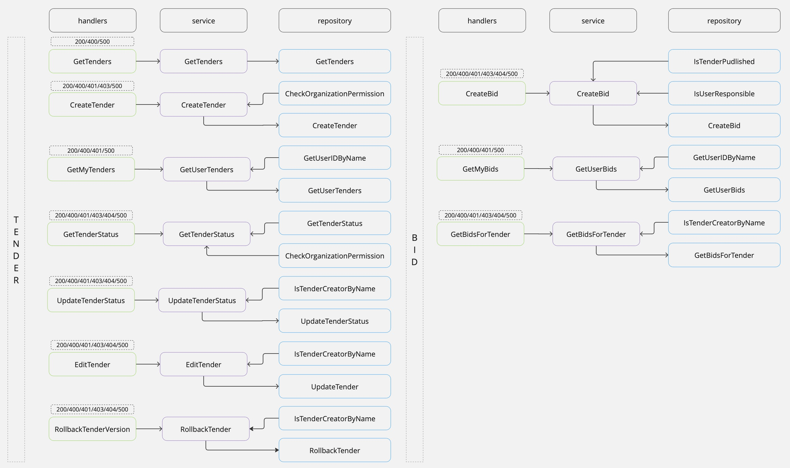

## Сервис проведения тендеров

### Стэк
- Go, Gin, pgxpool

### Логика сервиса

### Новые сущности
[migrations](https://git.codenrock.com/avito-testirovanie-na-backend-1270/cnrprod1725721384-team-77753/zadanie-6105/-/tree/dev/migrations?ref_type=heads)
- png со схемой таблиц

### Возникшие проблемы и их решения(ADR)

# README

## Таблица проблем и решений

| Номер | Проблема                                 | Описание                                                                                      | Решение                                                                                                                |
|-------|------------------------------------------|-----------------------------------------------------------------------------------------------|------------------------------------------------------------------------------------------------------------------------|
| 0     | Добавление таблиц                        | Нужно создать новые таблицы в БД, доступ к которой ограничен.                                | При запуске сервиса создавать таблицы, если их нет.                                                                    |
| 1     | Версирование данных                      | Необходимо хранить версии для `bid` и `tender` с возможностью отката.                         | Хранить версии в отдельных таблицах для упрощения управления.                                                            |
| 2     | Оптимизация проверки прав пользователя   | Выбор между двумя запросами в БД: проверка существования работника и связь работника с организацией, или выполнение всех в одном запросе. | Сделать один сложный запрос, чтобы уменьшить количество запросов к БД. Написать MVP, если останется время, сравнить и оптимизировать.|
| 3     | Кто может получать статус тендера       | Необходимо определить, какие пользователи могут получать статус тендера.                     | Так как есть скрытые от пользователя статусы и в запросе передается имя пользователя, решено, что только ответственные за организацию могут получать статус тендера. |
| 4     | Обновление статуса тендера               | Повышать ли версию тендера при обновлении статуса?                                            | Статус обновляется часто и не влияет на основные данные. К тому же есть ручка на изменение статуса, поэтому версия не инкрементируется. |
| 5     | Связь таблиц tender и employee для проверки прав доступа | Возвращаемая структура тендера не содержит информации об авторе, но необходимо проверять права доступа. | Изначально была создана отдельная таблица, чтобы не изменять структуру `tender`, но это оказалось избыточным, так как у тендера один автор. В таблицу `tender` добавлено поле с `username`, которое игнорируется в структуре тендера. |
| 6     | Отправка нескольких предложений на тендер | Нужно решить, давать ли возможность пользователю отправлять несколько предложений на тендер. | Чтобы не нарушать бизнес-логику — одно предложение от одной организации для одного тендера — и избежать проблем с управлением и обработкой предложений, отказалась от этой идеи. |

