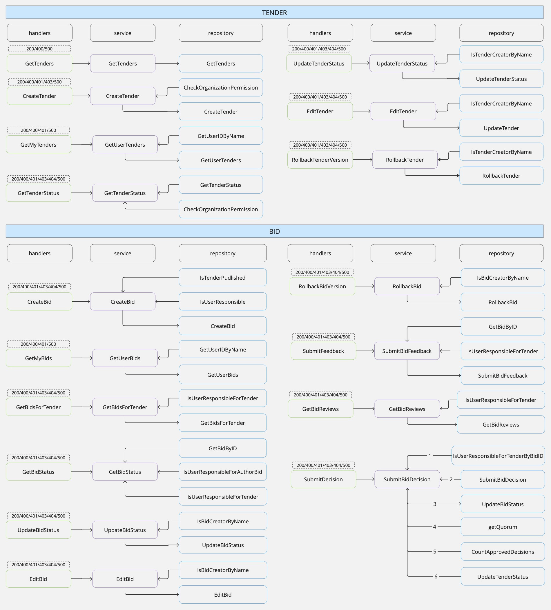

## Сервис проведения тендеров

### Стэк
- Go, Gin, pgxpool

### Запуск
```bash
make run
```

### Логика сервиса


## Возникшие проблемы и их решения (ADR)

| Номер | Группа   | Проблема                                 | Описание                                                                                      | Решение                                                                                                                |
|-------|---------|------------------------------------------|-----------------------------------------------------------------------------------------------|------------------------------------------------------------------------------------------------------------------------|
| 0     | database  | Добавление таблиц                        | Нужно создать новые таблицы в БД, доступ к которой ограничен.                                | При запуске сервиса создавать таблицы, если их нет.                                                                    |
| 1     | bid/tender | Версирование данных                      | Необходимо хранить версии для `bid` и `tender` с возможностью отката.                         | Хранить версии в отдельных таблицах для упрощения управления.                                                            |
| 2     | bid/tender | Оптимизация проверки прав пользователя   | Выбор между двумя запросами в БД: проверка существования работника и связь работника с организацией, или выполнение всех в одном запросе. | Сделать один сложный запрос, чтобы уменьшить количество запросов к БД. Написать MVP, если останется время, сравнить и оптимизировать. |
| 3     | tender  | Кто может получать статус тендера       | Необходимо определить, какие пользователи могут получать статус тендера.                     | Так как есть скрытые от пользователя статусы и в запросе передается имя пользователя, решено, что только ответственные за организацию могут получать статус тендера. |
| 4     | tender  | Обновление статуса тендера               | Повышать ли версию тендера при обновлении статуса?                                            | Статус обновляется часто и не влияет на основные данные. К тому же есть ручка на изменение статуса, поэтому версия не инкрементируется. |
| 5     | tender  | Связь таблиц tender и employee для проверки прав доступа | Возвращаемая структура тендера не содержит информации об авторе, но необходимо проверять права доступа. | Изначально была создана отдельная таблица, чтобы не изменять структуру `tender`, но это оказалось избыточным, так как у тендера один автор. В таблицу `tender` добавлено поле с `username`, которое игнорируется в структуре тендера. |
| 6     | bid     | Отправка нескольких предложений на тендер | Нужно решить, давать ли возможность пользователю отправлять несколько предложений на тендер. | Чтобы не нарушать бизнес-логику — одно предложение от одной организации для одного тендера — и избежать проблем с управлением и обработкой предложений, отказалась от этой идеи. |
| 7     | bid     | Получение предложений по тендеру        | Предложения с какими статусами выдавать создателю тендера: только `published` или все кроме `created`. | Выдавать все статусы, кроме `created`, так как это позволит увидеть историю работы с предложениями. |


### Новые сущности
[migrations](https://git.codenrock.com/avito-testirovanie-na-backend-1270/cnrprod1725721384-team-77753/zadanie-6105/-/tree/dev/migrations?ref_type=heads)

### Tender 
- Таблицы для управления тендерами и их версиями. Основная таблица хранит текущие тендеры, а дополнительная — их версии с изменениями
```sql
DO $$
BEGIN
    IF NOT EXISTS (SELECT 1 FROM pg_type WHERE typname = 'service_type') THEN
        CREATE TYPE service_type AS ENUM ('Construction', 'Delivery', 'Manufacture');
    END IF;
END $$;

DO $$
BEGIN
    IF NOT EXISTS (SELECT 1 FROM pg_type WHERE typname = 'tender_status') THEN
        CREATE TYPE tender_status AS ENUM ('Created', 'Published', 'Closed');
    END IF;
END $$;

CREATE TABLE IF NOT EXISTS tender (
    id UUID PRIMARY KEY DEFAULT uuid_generate_v4(),
    name VARCHAR(100) NOT NULL,
    description TEXT CHECK (LENGTH(description) <= 500),
    service_type service_type NOT NULL,
    status tender_status DEFAULT 'Created',
    organization_id UUID NOT NULL REFERENCES organization(id) ON DELETE CASCADE,
    version INT DEFAULT 1 CHECK (version >= 1),
    created_at TIMESTAMPTZ DEFAULT NOW(),
    creator_username VARCHAR(50) NOT NULL
);

CREATE TABLE IF NOT EXISTS tender_version (
    tender_id UUID NOT NULL REFERENCES tender(id) ON DELETE CASCADE, 
    name VARCHAR(100) NOT NULL,
    description TEXT CHECK (LENGTH(description) <= 500), 
    service_type service_type NOT NULL,
    status tender_status DEFAULT 'Created',
    organization_id UUID NOT NULL REFERENCES organization(id) ON DELETE CASCADE,
    version INT DEFAULT 1 CHECK (version >= 1),
    created_at TIMESTAMPTZ NOT NULL DEFAULT NOW(), 
    creator_username VARCHAR(50) NOT NULL,
    PRIMARY KEY (tender_id, version) 
);
```

### BID
- Таблицы управляют заявками (bid) и их версиями, а также решениями и отзывами по ним. Таблица bid хранит текущие заявки, bid_version — их версии, bid_decision — решения по заявкам, а bid_feedback — отзывы о заявках.
```sql
DO $$
BEGIN
    IF NOT EXISTS (SELECT 1 FROM pg_type WHERE typname = 'bid_status') THEN
        CREATE TYPE bid_status AS ENUM ('Created', 'Published', 'Canceled', 'Approved', 'Rejected');
    END IF;
END $$;

DO $$
BEGIN
    IF NOT EXISTS (SELECT 1 FROM pg_type WHERE typname = 'bid_author_type') THEN
        CREATE TYPE bid_author_type AS ENUM ('Organization', 'User');
    END IF;
END $$;

CREATE TABLE IF NOT EXISTS bid (
    id UUID PRIMARY KEY DEFAULT uuid_generate_v4(),
    name VARCHAR(100) NOT NULL,
    description TEXT NOT NULL CHECK (LENGTH(description) <= 500), 
    status bid_status NOT NULL DEFAULT 'Created',
    tender_id UUID NOT NULL REFERENCES tender(id) ON DELETE CASCADE, 
    author_type bid_author_type NOT NULL,
    author_id UUID NOT NULL REFERENCES employee(id) ON DELETE CASCADE, 
    version INT NOT NULL DEFAULT 1 CHECK (version >= 1), 
    created_at TIMESTAMPTZ NOT NULL DEFAULT NOW(),
    UNIQUE (tender_id, author_id)
);

CREATE TABLE IF NOT EXISTS bid_version (
    bid_id UUID NOT NULL REFERENCES bid(id) ON DELETE CASCADE, 
    name VARCHAR(100) NOT NULL,
    description TEXT CHECK (LENGTH(description) <= 500), 
    status bid_status NOT NULL, 
    tender_id UUID NOT NULL REFERENCES tender(id) ON DELETE CASCADE, 
    author_type bid_author_type NOT NULL, 
    author_id UUID NOT NULL REFERENCES employee(id) ON DELETE CASCADE,
    version INT NOT NULL CHECK (version >= 1), 
    created_at TIMESTAMPTZ NOT NULL DEFAULT NOW(), 
    PRIMARY KEY (bid_id, version) 
);

CREATE TABLE IF NOT EXISTS bid_decision (
    id UUID PRIMARY KEY DEFAULT uuid_generate_v4(),
    bid_id UUID NOT NULL REFERENCES bid(id) ON DELETE CASCADE,
    user_id UUID NOT NULL REFERENCES employee(id) ON DELETE CASCADE,
    decision VARCHAR(10) NOT NULL CHECK (decision IN ('Approved', 'Rejected')),  
    UNIQUE (bid_id, user_id) 
);


CREATE TABLE IF NOT EXISTS bid_feedback (
    id UUID PRIMARY KEY DEFAULT uuid_generate_v4(), 
    bid_id UUID NOT NULL REFERENCES bid(id) ON DELETE CASCADE, 
    description TEXT CHECK (LENGTH(description) <= 500), 
    created_at TIMESTAMPTZ NOT NULL DEFAULT NOW() 
);
```
